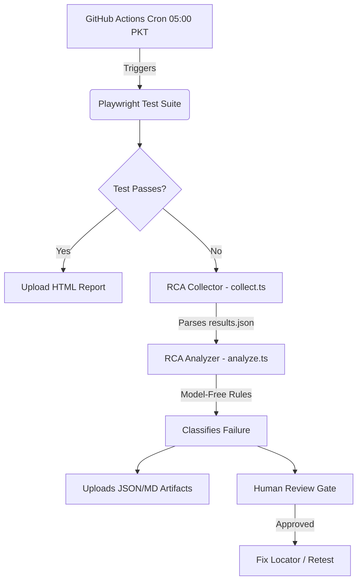

# Architecture Diagram

```mermaid
graph TD
    A[GitHub Actions Cron 05:00 PKT] -->|Triggers| B(Playwright Test Suite)
    B --> C{Test Passes?}
    C -->|Yes| D[Upload HTML Report]
    C -->|No| E[RCA Collector - collect.ts]
    E -->|Parses results.json| F[RCA Analyzer - analyze.ts]
    F -->|Model-Free Rules| G[Classifies Failure]
    G --> H[Uploads JSON/MD Artifacts]
    G --> I[Human Review Gate]
    I -->|Approved| J[Fix Locator / Retest]
```

Full component diagram, stop conditions and trust boundaries: [architecture-detailed.md](architecture-detailed.md).
